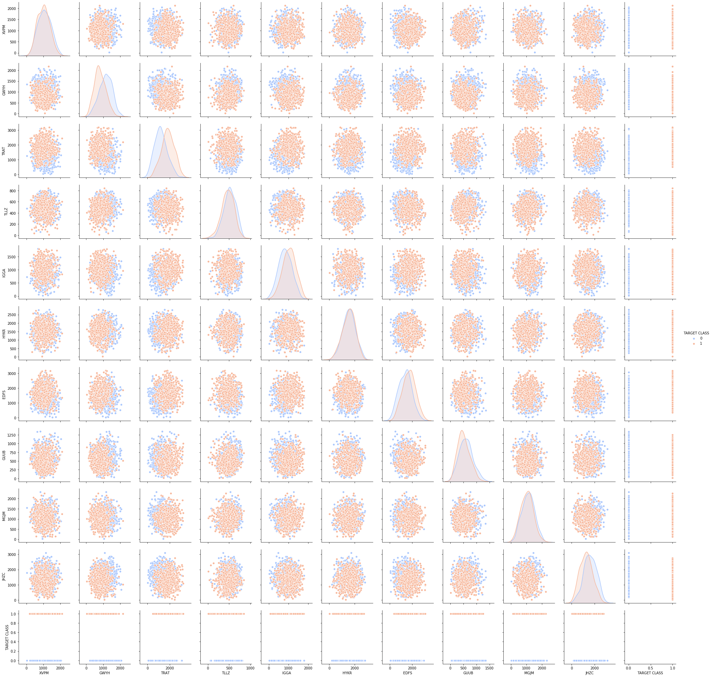
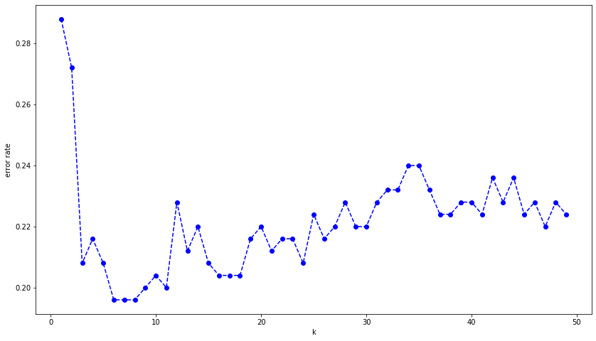

# K Nearest Neighbors - Project 

<p>This is a project from: Python fod Data Science and Machine learning - Udemy. 
    <p>The main objective is import dataset, do data processing and use KNN to create a prediction model.


```python
# The first step is import all libraries that will be used.
import numpy as np
import pandas as pd
import seaborn as sns
import matplotlib.pyplot as plt
%matplotlib inline
```


```python
# Import data into a dataframe
data = pd.read_csv('KNN_Project_Data')
```

** Verifique o cabeçalho do DataFrame.**


```python
# It's interesting to use some methods to give a first look to data.
# I usually use head(), info() and describe
```


```python
data.head()
```


<div>
<style scoped>
    .dataframe tbody tr th:only-of-type {
        vertical-align: middle;
    }

    .dataframe tbody tr th {
        vertical-align: top;
    }

    .dataframe thead th {
        text-align: right;
    }
</style>
<table border="1" class="dataframe">
  <thead>
    <tr style="text-align: right;">
      <th></th>
      <th>XVPM</th>
      <th>GWYH</th>
      <th>TRAT</th>
      <th>TLLZ</th>
      <th>IGGA</th>
      <th>HYKR</th>
      <th>EDFS</th>
      <th>GUUB</th>
      <th>MGJM</th>
      <th>JHZC</th>
      <th>TARGET CLASS</th>
    </tr>
  </thead>
  <tbody>
    <tr>
      <td>0</td>
      <td>1636.670614</td>
      <td>817.988525</td>
      <td>2565.995189</td>
      <td>358.347163</td>
      <td>550.417491</td>
      <td>1618.870897</td>
      <td>2147.641254</td>
      <td>330.727893</td>
      <td>1494.878631</td>
      <td>845.136088</td>
      <td>0</td>
    </tr>
    <tr>
      <td>1</td>
      <td>1013.402760</td>
      <td>577.587332</td>
      <td>2644.141273</td>
      <td>280.428203</td>
      <td>1161.873391</td>
      <td>2084.107872</td>
      <td>853.404981</td>
      <td>447.157619</td>
      <td>1193.032521</td>
      <td>861.081809</td>
      <td>1</td>
    </tr>
    <tr>
      <td>2</td>
      <td>1300.035501</td>
      <td>820.518697</td>
      <td>2025.854469</td>
      <td>525.562292</td>
      <td>922.206261</td>
      <td>2552.355407</td>
      <td>818.676686</td>
      <td>845.491492</td>
      <td>1968.367513</td>
      <td>1647.186291</td>
      <td>1</td>
    </tr>
    <tr>
      <td>3</td>
      <td>1059.347542</td>
      <td>1066.866418</td>
      <td>612.000041</td>
      <td>480.827789</td>
      <td>419.467495</td>
      <td>685.666983</td>
      <td>852.867810</td>
      <td>341.664784</td>
      <td>1154.391368</td>
      <td>1450.935357</td>
      <td>0</td>
    </tr>
    <tr>
      <td>4</td>
      <td>1018.340526</td>
      <td>1313.679056</td>
      <td>950.622661</td>
      <td>724.742174</td>
      <td>843.065903</td>
      <td>1370.554164</td>
      <td>905.469453</td>
      <td>658.118202</td>
      <td>539.459350</td>
      <td>1899.850792</td>
      <td>0</td>
    </tr>
  </tbody>
</table>
</div>


```python
data.info()
```

    <class 'pandas.core.frame.DataFrame'>
    RangeIndex: 1000 entries, 0 to 999
    Data columns (total 11 columns):
    XVPM            1000 non-null float64
    GWYH            1000 non-null float64
    TRAT            1000 non-null float64
    TLLZ            1000 non-null float64
    IGGA            1000 non-null float64
    HYKR            1000 non-null float64
    EDFS            1000 non-null float64
    GUUB            1000 non-null float64
    MGJM            1000 non-null float64
    JHZC            1000 non-null float64
    TARGET CLASS    1000 non-null int64
    dtypes: float64(10), int64(1)
    memory usage: 86.1 KB
    


```python
data.describe()
```


<div>
<style scoped>
    .dataframe tbody tr th:only-of-type {
        vertical-align: middle;
    }

    .dataframe tbody tr th {
        vertical-align: top;
    }

    .dataframe thead th {
        text-align: right;
    }
</style>
<table border="1" class="dataframe">
  <thead>
    <tr style="text-align: right;">
      <th></th>
      <th>XVPM</th>
      <th>GWYH</th>
      <th>TRAT</th>
      <th>TLLZ</th>
      <th>IGGA</th>
      <th>HYKR</th>
      <th>EDFS</th>
      <th>GUUB</th>
      <th>MGJM</th>
      <th>JHZC</th>
      <th>TARGET CLASS</th>
    </tr>
  </thead>
  <tbody>
    <tr>
      <td>count</td>
      <td>1000.000000</td>
      <td>1000.000000</td>
      <td>1000.000000</td>
      <td>1000.000000</td>
      <td>1000.000000</td>
      <td>1000.000000</td>
      <td>1000.000000</td>
      <td>1000.000000</td>
      <td>1000.000000</td>
      <td>1000.000000</td>
      <td>1000.00000</td>
    </tr>
    <tr>
      <td>mean</td>
      <td>1055.071157</td>
      <td>991.851567</td>
      <td>1529.373525</td>
      <td>495.107156</td>
      <td>940.590072</td>
      <td>1550.637455</td>
      <td>1561.003252</td>
      <td>561.346117</td>
      <td>1089.067338</td>
      <td>1452.521629</td>
      <td>0.50000</td>
    </tr>
    <tr>
      <td>std</td>
      <td>370.980193</td>
      <td>392.278890</td>
      <td>640.286092</td>
      <td>142.789188</td>
      <td>345.923136</td>
      <td>493.491988</td>
      <td>598.608517</td>
      <td>247.357552</td>
      <td>402.666953</td>
      <td>568.132005</td>
      <td>0.50025</td>
    </tr>
    <tr>
      <td>min</td>
      <td>21.170000</td>
      <td>21.720000</td>
      <td>31.800000</td>
      <td>8.450000</td>
      <td>17.930000</td>
      <td>27.930000</td>
      <td>31.960000</td>
      <td>13.520000</td>
      <td>23.210000</td>
      <td>30.890000</td>
      <td>0.00000</td>
    </tr>
    <tr>
      <td>25%</td>
      <td>767.413366</td>
      <td>694.859326</td>
      <td>1062.600806</td>
      <td>401.788135</td>
      <td>700.763295</td>
      <td>1219.267077</td>
      <td>1132.097865</td>
      <td>381.704293</td>
      <td>801.849802</td>
      <td>1059.499689</td>
      <td>0.00000</td>
    </tr>
    <tr>
      <td>50%</td>
      <td>1045.904805</td>
      <td>978.355081</td>
      <td>1522.507269</td>
      <td>500.197421</td>
      <td>939.348662</td>
      <td>1564.996551</td>
      <td>1565.882879</td>
      <td>540.420379</td>
      <td>1099.087954</td>
      <td>1441.554053</td>
      <td>0.50000</td>
    </tr>
    <tr>
      <td>75%</td>
      <td>1326.065178</td>
      <td>1275.528770</td>
      <td>1991.128626</td>
      <td>600.525709</td>
      <td>1182.578166</td>
      <td>1891.937040</td>
      <td>1981.739411</td>
      <td>725.762027</td>
      <td>1369.923665</td>
      <td>1864.405512</td>
      <td>1.00000</td>
    </tr>
    <tr>
      <td>max</td>
      <td>2117.000000</td>
      <td>2172.000000</td>
      <td>3180.000000</td>
      <td>845.000000</td>
      <td>1793.000000</td>
      <td>2793.000000</td>
      <td>3196.000000</td>
      <td>1352.000000</td>
      <td>2321.000000</td>
      <td>3089.000000</td>
      <td>1.00000</td>
    </tr>
  </tbody>
</table>
</div>


Analyzing data, it's possible to see that all lines and columns are completed with float non-null data.


```python
# In this part is very usefull to create a pairplot to observe the behavior of  how one variable affects another.

sns.pairplot(data,hue='TARGET CLASS', palette='coolwarm')

# Firts Parameter: dataframe
# hue: Select witch column will be used to color the graphs
# palette: color code used. Acess: https://seaborn.pydata.org/tutorial/color_palettes.html for reference
```

    C:\Users\DigaoSuplementos\Anaconda3\lib\site-packages\statsmodels\nonparametric\kde.py:487: RuntimeWarning: invalid value encountered in true_divide
      binned = fast_linbin(X, a, b, gridsize) / (delta * nobs)
    C:\Users\DigaoSuplementos\Anaconda3\lib\site-packages\statsmodels\nonparametric\kdetools.py:34: RuntimeWarning: invalid value encountered in double_scalars
      FAC1 = 2*(np.pi*bw/RANGE)**2
    


    <seaborn.axisgrid.PairGrid at 0x29cb11c71c8>





<p/>In this case the KNN model basically calculate the distance between points.<p/>
<p/>It's important to normalize data in order to avoid wrong decisions due to the order of magnitude of a given data.<p/>
<p/>To do this I'll use a tool from skilearn package.<p/>


```python
from sklearn.preprocessing import StandardScaler

# Create an instance of StandarScaler class

scaler = StandardScaler()

# To fit the model I'll pass all columns unless the "TARGET CLASS"

scaler.fit(data.drop('TARGET CLASS', axis=1))

# axis = 1 means that I'll exclude the column with name 'TARGET CLASS' 

# This method normalize the orginal dataset.
# Return a array
data_standard = scaler.transform(data.drop('TARGET CLASS', axis=1))
```


```python
# Now, I'll create a data frame using the transformed data.

data_param = pd.DataFrame(data_standard,columns = ['XVPM','GWYH','TRAT','TLLZ','IGGA','HYKR','EDFS','GUUB','MGJM','JHZC'])
```


```python
# Just apply head() to verify the data frame.
# This DataFrame will be used as x input to KNN model
data_param.head()
```


<div>
<style scoped>
    .dataframe tbody tr th:only-of-type {
        vertical-align: middle;
    }

    .dataframe tbody tr th {
        vertical-align: top;
    }

    .dataframe thead th {
        text-align: right;
    }
</style>
<table border="1" class="dataframe">
  <thead>
    <tr style="text-align: right;">
      <th></th>
      <th>XVPM</th>
      <th>GWYH</th>
      <th>TRAT</th>
      <th>TLLZ</th>
      <th>IGGA</th>
      <th>HYKR</th>
      <th>EDFS</th>
      <th>GUUB</th>
      <th>MGJM</th>
      <th>JHZC</th>
    </tr>
  </thead>
  <tbody>
    <tr>
      <td>0</td>
      <td>1.568522</td>
      <td>-0.443435</td>
      <td>1.619808</td>
      <td>-0.958255</td>
      <td>-1.128481</td>
      <td>0.138336</td>
      <td>0.980493</td>
      <td>-0.932794</td>
      <td>1.008313</td>
      <td>-1.069627</td>
    </tr>
    <tr>
      <td>1</td>
      <td>-0.112376</td>
      <td>-1.056574</td>
      <td>1.741918</td>
      <td>-1.504220</td>
      <td>0.640009</td>
      <td>1.081552</td>
      <td>-1.182663</td>
      <td>-0.461864</td>
      <td>0.258321</td>
      <td>-1.041546</td>
    </tr>
    <tr>
      <td>2</td>
      <td>0.660647</td>
      <td>-0.436981</td>
      <td>0.775793</td>
      <td>0.213394</td>
      <td>-0.053171</td>
      <td>2.030872</td>
      <td>-1.240707</td>
      <td>1.149298</td>
      <td>2.184784</td>
      <td>0.342811</td>
    </tr>
    <tr>
      <td>3</td>
      <td>0.011533</td>
      <td>0.191324</td>
      <td>-1.433473</td>
      <td>-0.100053</td>
      <td>-1.507223</td>
      <td>-1.753632</td>
      <td>-1.183561</td>
      <td>-0.888557</td>
      <td>0.162310</td>
      <td>-0.002793</td>
    </tr>
    <tr>
      <td>4</td>
      <td>-0.099059</td>
      <td>0.820815</td>
      <td>-0.904346</td>
      <td>1.609015</td>
      <td>-0.282065</td>
      <td>-0.365099</td>
      <td>-1.095644</td>
      <td>0.391419</td>
      <td>-1.365603</td>
      <td>0.787762</td>
    </tr>
  </tbody>
</table>
</div>


```python
# Define y to KNN model
y_global = data['TARGET CLASS']
```


```python
# As in this case I have all data into a unique data frame, now I have to split data into train and test parts.
from sklearn.model_selection import train_test_split

# This method returns a tuple with (x_train, x_test, y_train, y_test)
x_train, x_test,y_train, y_test = train_test_split(data_param,y_global)
```


```python
# Now it's time to fit KNN model using train data.
from sklearn.neighbors import KNeighborsClassifier

# I'll start using just one neighbors
knn_model = KNeighborsClassifier(n_neighbors=1)

#fit model
knn_model.fit(x_train, y_train)

#predict results
predictions = knn_model.predict(x_test)
```


```python
# Time to analyze the accuracy of knn model
from sklearn.metrics import classification_report, confusion_matrix
print(classification_report(y_test,predictions))
print(confusion_matrix(y_test,predictions))
```

                  precision    recall  f1-score   support
    
               0       0.69      0.74      0.71       121
               1       0.74      0.69      0.71       129
    
        accuracy                           0.71       250
       macro avg       0.71      0.71      0.71       250
    weighted avg       0.71      0.71      0.71       250
    
    [[89 32]
     [40 89]]
    

# Choosing the best K

Here, I'll use diferent K values to determine wich one is the best choice to predict data.


```python
error_rate = []

for i in range(1,50):
    
    knn_model = KNeighborsClassifier(n_neighbors=i)
    knn_model.fit(x_train,y_train)
    predictions_i = knn_model.predict(x_test)
    error_rate.append(np.mean(predictions_i!=y_test.tolist()))
```


```python
plt.figure(figsize=(14,8))
plt.plot(range(1,50),error_rate,color='blue', linestyle = 'dashed', marker='o')
plt.xlabel('k')
plt.ylabel('error rate')
```


    Text(0, 0.5, 'error rate')





```python
# Refit the model using K = 30

from sklearn.neighbors import KNeighborsClassifier


knn_model = KNeighborsClassifier(n_neighbors=30)


knn_model.fit(x_train, y_train)


predictions = knn_model.predict(x_test)
```


```python
# Time to analyze the accuracy of knn model
from sklearn.metrics import classification_report, confusion_matrix
print('K=30')
print()
print()
print(classification_report(y_test,predictions))
print(confusion_matrix(y_test,predictions))
```

    K=30
    
    
                  precision    recall  f1-score   support
    
               0       0.76      0.80      0.78       121
               1       0.80      0.76      0.78       129
    
        accuracy                           0.78       250
       macro avg       0.78      0.78      0.78       250
    weighted avg       0.78      0.78      0.78       250
    
    [[97 24]
     [31 98]]
    


```python

```
